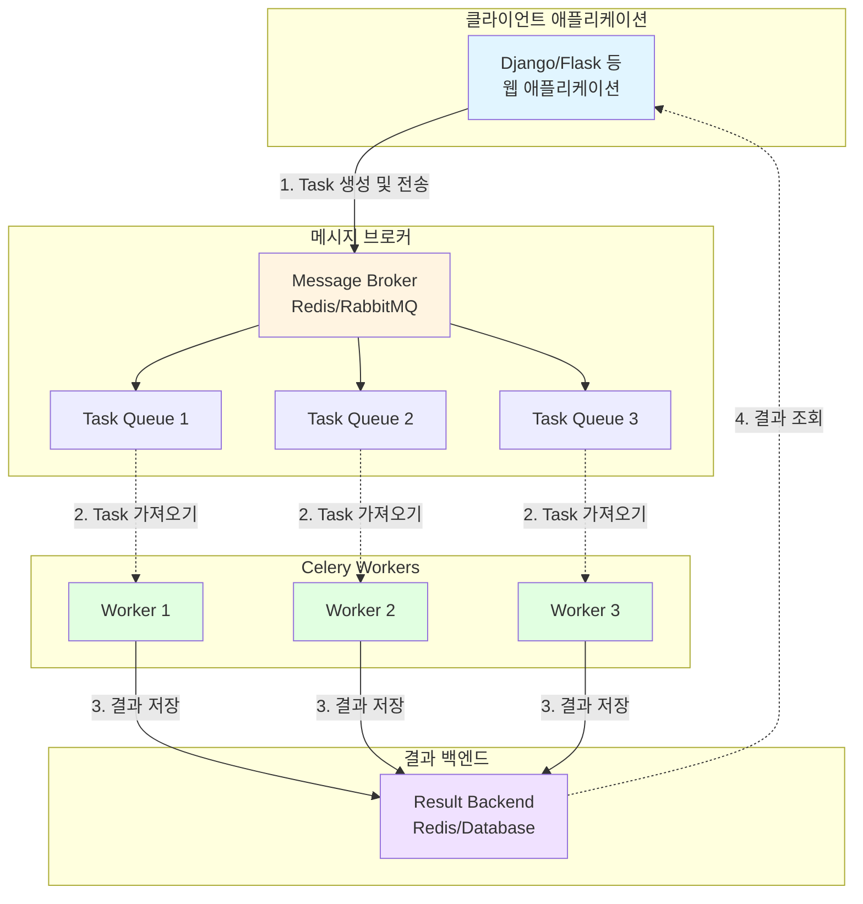

# 회사에서 진행했던 일들 정리(2)

데이터 관리 웹 구축 시 가장 많이 사용했던 Celery.  
대용량 데이터 업로드/다운로드/일괄 변경/예약 작업 등 많은 작업에 활용했는데  
안 써놓으면 까먹을 것 같아서 정리해보았다.  

## ❓ Celery 란?

 **Celery**:  Python으로 작성된 분산 작업 큐(Distributed Task Queue) 시스템. 주로  Python application 에서 비동기 작업 실행, 실시간 작업 처리,예약된 작업 실행을 위해 사용된다. 
 <details>
 <summary>작업 큐(Task Queue) 란?</summary>

  Celery 공식 문서에서는 "Task queues are used as a mechanism to distribute work across threads or machines." 라고 나와 있다.

  스레드나 머신에 작업을 분산하는 메커니즘 이라는 말인데. 쉽게 정리하자면 소프트웨어 시스템에서 시간이 오래 걸리거나 리소스를 많이 소모하는 작업을 바로 처리하지 않고 비동기적으로 처리하도록 미루어두는 것이다.

  실제 큐(Queue) 자료 구조와 유사하게 생산자-소비자(Producer-Consumer) 모델을 기반으로 작동한다.
 </details>


#### ℹ️ Celery의 작동 구조

 Celery의 는 클라이언트(혹은 애플리케이션)/ 메시지 브로커(Message Broker)/ 워커(Worker)/ 백엔드(Result Backend) 로 구성된다.  
 이때 백엔드는 선택 사항에 가깝다.  
 작동 순서는 밑과 같다.  

 1) 클라이언트에서 Celery 를 통해 Task(작업)을 발행(Publish), 비동기적으로 실행하도록 요청
 2) 메세지 브로커에서 task 메세지를 받고 이에 대한 정보를 브로커의 큐에 저장
 3) 큐에 새로운 Task 메시지가 들어오면, 워커가 이를 가져와서(Consume) 실제로 Task에 정의된 함수를 실행
 4) 워커가 Task를 처리한 결과나 상태를 백엔드에 저장

이를 머메이드로 나타내면 밑과 같다.  



## 🤔 왜 Celery 를 사용했는가?

 당시 파일 업로드/ 다운로드 / 파일명 일괄 변경 등등 대용량&다량의 파일들을 백그라운드에서 처리해야 하는 문제가 있었다.  
 Django가 비동기 처리를 지원하긴 하는데... 나는 백그라운드에서 처리할 수 있어야 한다 + 파일 처리 등 시간이 오래 걸리는 작업을 단순히 Django에서 지원하는 비동기 뷰로 처리할 수 있는지 모르겠다는 이유로 Celery를 사용했다.  
 접근 방식은 100개 이상/총 용량 500mb 이상의 데이터를 다뤄야 할 경우 Celery를 사용하도록 하는 거였고 밑과 같이 구현했다.  
 ```
 사용자 요청→Django 뷰→Celery Task 발행→사용자에게 즉시 응답(백그라운드) →Celery 워커가 Task 처리 → 결과 저장/알림
 ```


#### ✅ 장점

 1. 비동기 및 백그라운드 처리 (Asynchronous Processing): 시간이 오래 걸리는 작업을 백그라운드로 넘겨서 응답 시간을 줄이고, 작업 완료를 기다리지 않고 앱을 계속 사용하는 것이 가능하다.

 2. 확장성 및 분산 처리 (Scalability & Distributed Processing): 작업 부하가 늘어나면 워커 프로세스나 서버(멀티 디바이스) 수를 쉽게 늘려 처리량을 증가시킬 수 있고, 작업을 여러 워커에 분산시켜 처리하므로 단일 서버 과부하를 방지할 수 있다.

 3. 신뢰성 및 내결함성 (Reliability & Fault Tolerance): Task 정보가 메시지 브로커에 저장되므로, 웹 서버나 워커가 다운되어도 작업이 유실되지 않고 복구 후 재처리될 수 있다. 또한 외부 서비스 통신 실패 등의 일시적인 오류 발생 시, Task의 자동 재시도 로직을 쉽게 구현할 수 있다.

 4. 스케줄링 (Scheduling): Celery Beat 컴포넌트를 사용하여 특정 시간에 실행하거나 주기적으로 반복 실행해야 하는 작업(크론 작업)을 쉽게 설정할 수 있다.


#### ❌ 단점

 단점은 하나다. 어플리케이션 구조가 정말 복잡해진다.  
 일단 시스템에 새로운 계층 하나가 더 추가되는 거라서..  
 Celery는 기본적으로 메세지 브로커로 쓸 RabbitMQ, Redis 등을 설치해야 하는데다가 Celery의 워커 관리도 처음 하면 좀 복잡하다.  
 거기에 chain,Chord,Group 등 과 같은 워크플로우 구성 기능까지 쓴다고 하면 여러모로 신경쓸 것도 많고 굉장히 복잡해진다.  


## 💡 어떻게 쓰면 되지?

 Django에 적용하는 방법은 공식문서의 [First steps with Django](https://docs.celeryq.dev/en/stable/django/first-steps-with-django.html#django-first-steps)에 자세하게 나와 있다.  
 이걸 참고해서 Django에 적용하는건 다음에 자세하게 쓰도록 하고, 여기서는 도커를 사용한 설치 방법과 사용 예제만 가볍게 적어보았다.  


#### 설치

Celery와 메시지 브로커(여기서는 Redis)를 위한 Python 라이브러리를 설치한다.

```bash
# Celery 및 Redis 백엔드용 라이브러리 설치
pip install "celery[redis]"
```

#### Celery 앱 생성 (`celery_app.py`)

Celery 인스턴스를 생성하고 사용할 브로커와 백엔드를 설정한다.

```python
from celery import Celery

# Redis 브로커와 백엔드 사용 예시
# Windows에서는 Redis를 로컬 설치 대신 Docker 사용을 권장
app = Celery(
    "my_app",
    broker="redis://localhost:6379/0",
    backend="redis://localhost:6379/1",  # FastAPI/Django 등과 함께 사용 가능
)
```

#### Task 정의 (`tasks.py`)

실제로 백그라운드에서 실행할 작업을 정의한다.

```python
from celery_app import app

# @app.task 데코레이터를 사용하여 일반 함수를 Celery Task로 만든다.
@app.task
def add(x, y):
    return x + y
```

#### Celery 워커 실행

```bash
celery -A celery_app worker --loglevel=info
```

이 명령어를 실행하면 워커가 시작되고, 브로커가 새로운 Task를 기다리는 상태가 된다.
이후 다른 스크립트/뷰 등에서 task를 비동기적으로 호출하여 사용하면 된다.

```python
from tasks import add

# Task를 비동기적으로 실행 요청 (.delay()는 apply_async()의 간이 버전)
result = add.delay(4, 6)

# Task의 결과를 확인하려면 .get() 사용 (프로덕션에서는 타임아웃/예외 처리 권장)
try:
    final_result = result.get(timeout=10)  # 최대 10초 대기
    print(f"Task 결과: {final_result}")
except Exception as e:
    print(f"Task 실행 중 오류 발생 또는 타임아웃: {e}")
```


