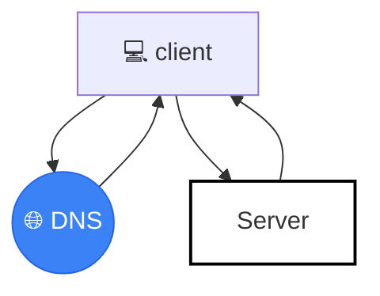
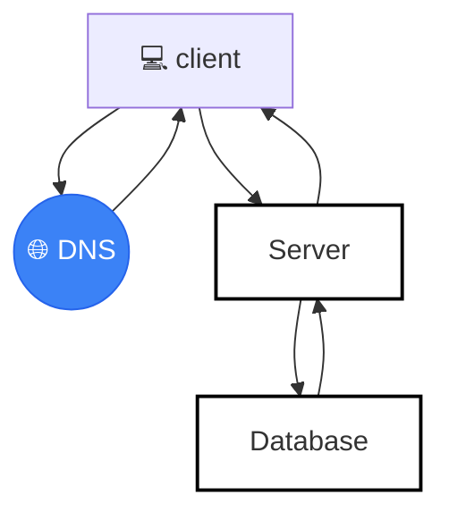

# 시스템 디자인
학교 다닐때 시스템 디자인 수업을 듣지 않았었다  
딱히 들을 이유가 없지 않나 싶기도 했고 사실 시간이 없어서...  
그런데 회사 근무하면서 시스템 설계 쪽을 조금 건들 일이 있었고 좀 이 부분에 대해 공부를 할 필요성을 느껴서 책 <가상 면접 사례로 배우는 대규모 시스템 설계 기초>+ 강의 [시스템 설계: 한번에 인터뷰 합격하기](https://www.udemy.com/course/best-system-design-interview/)를 같이 보며 공부한 내용을 정리해보았다.


## 시스템 디자인이란❓ 
시스템이 최종 사용자 요구 사항을 충족할 수 있도록 아키텍처, 구성 요소 및 인터페이스를 설계하는 과정.  
시스템 설계 시 고려해야 할 중요 속성은 밑과 같다.

- **가용성** : 시스템 또는 구성 요소가 바람직하게 긴 시간 동안 지속적으로 작동할 수 있는 능력
- **신뢰성** : 시스템이 지정된 작동 조건 하에서 주어진 기간 동안 실패 없이 의도한 기능을 얼마나 일관되게 수행하는지
- **일관성** : 분산 시스템의 모든 노드가 특정 시점에 동일한 데이터 뷰를 가지도록 보장하는 속성
- **확장성** : 시스템의 성능 저하 없이 증가하는 작업 부하를 처리할 수 있는 능력
- **유지보수성** : 시스템을 쉽게 수정하고 업데이트하며 결함을 수정할 수 있게 하는 능력
- **결함 감내성** : 시스템이 결함에도 불구하고 계속해서 기능을 수행하는 능력
- **지연 시간** : 요청이 시작된 시점부터 응답을 받기까지 걸리는 시간
- **처리량** : 시스템이 주어진 시간 내에 처리할 수 있는 작업량 또는 트래픽의 양

이번 포스트에서는 사용자 수에 따른 규모 확장성에 대해서 우선 정리해보겠다.


#### 사용자 수에 따른 규모 확장성

단일 서버 설정은 가장 간단한 시작점으로 웹/앱/데이터베이스/캐시 등 모든 것이 하나의 서버에서 실행되는 구조이다.  
간단한 만큼 많은 사용자가 이용할 경우라면 트래픽을 처리하기 어렵고, 가용성도 떨어져 실제 서비스에서는 사용하지 않는다. 


사용자가 증가함에 따라 각자의 확장성을 위해서 위와 같이 서버와 데이터베이스를 분리한다.  


## 수직적 규모 확장 vs 수평적 규모 확장
단일 서버는 위와 같은 단점을 가지기 때문에 수직적 규모 확장(vertical scaling)과 수평적 규모 확장(horizontal scaling)을 진행하게 된다.


### ℹ️ 수직적 규모 확장(vertical scaling)
수직적 규모 확장은 스케일링 업(scaling up)으로도 알려져 있는 방법으로, 단일 서버의 성능을 향상시키는 방법으로 CPU, 메모리, 스토리지 등의 **자원을 추가하거나 업그레이드**하는 것이다.  
한 마디로 구조는 그대로 유지하되 자원만 늘리는 방법이라고 생각하면 된다.  
장점은 굉장히 단순하다는 것이고, 단점은 한 대의 서버에 자원을 무한대로 증설할 수 없으니 한계가 있다는 점, 장애에 대한 자동복구(failover) 방안이나 다중화 방안을 제시하지 않아 서버에 장애가 발생하면 웹사이트/앱은 완전히 중단된다는 점이다.


### ℹ️ 수평적 규모 확장(horizontal scaling)
수평적 규모 확장은 스케일링 아웃(scaling out)으로도 알려져 있는 방법으로, 여러 대의 서버를 추가하여 트래픽을 분산시키는 방법이다.  
트래픽에 따라 유동적으로 서버를 추가하거나 제거하여 비용을 효율화시킬 수 있다.  
수평적 확산 방법은 크게 4가지 범주로 볼 수 있다

1) 애플리케이션 계층 및 부하 분산
2) 데이터 계층 및 저장소 확장
3) 비동기 처리 및 시스템 구성 요소의 분리
4) 콘텐츠 전송 효율화

각 범주에 포함되는 기술 요소를 하나씩 설명해보겠다.

#### 1. 애플리케이션 계층 및 부하 분산
이 범주는 사용자에게 직접 서비스를 제공하는 계층과 요청을 효율적으로 처리하기 위해 트래픽을 분배한다.

**로드 밸런서 (Load Balancer)**: 네트워킹 장치 또는 소프트웨어 애플리케이션. 들어오는 트래픽을 서버들 사이에 분산시키고 균형을 맞춘다.

**무상태 웹 계층 유지 (Keep Web Tier Stateless)**:  서버에서 사용자 세션과 같은 **상태(state)**를 제거하고 영구 저장소에 저장함으로써, 필요에 따라 웹 서버를 쉽게 추가하거나 제거할 수 있는 수평적 확장을 용이하게 한다.

**마이크로서비스 아키텍처 (Microservice Architecture)**: 시스템을 개별 서비스로 분할하여 각 서비스를 독립적으로 개발, 배포 및 확장할 수 있다.

#### 2. 데이터 계층 및 저장소 확장
이 범주는 데이터베이스와 저장 시스템의 용량 및 처리 한계를 극복하기 위해 데이터를 분산한다.

**데이터 샤딩 (Data Sharding) 또는 파티셔닝 (Partitioning)**: 데이터베이스를 여러 인스턴스에 분할하여 저장하는 기술. 대용량 데이터 저장 능력과 확장성을 위해 중요하다.

**안정 해시 (Consistent Hashing)**: 분산 캐시 시스템이나 키-값 저장소 설계에서 데이터의 증분 확장성(Incremental scalability) 및 데이터 파티션 문제를 해결하기 위해 사용. 서버가 추가되거나 제거될 때 재분배되는 키의 수를 최소화하여 효율적인 확장을 지원한다.

**데이터 복제 (Data Replication)**: 마스터-슬레이브 또는 다중 마스터 복제를 통해 읽기 부하를 분산하고 읽기 처리량을 확장하여 시스템의 고가용성을 확보한다.

**캐싱 (Caching)**: 데이터베이스의 부하를 줄이고 요청 처리의 **지연 시간(Latency)**을 줄여 전반적인 시스템 성능과 확장성을 개선한다. 뉴스 피드 시스템에서는 콘텐츠 캐시, 소셜 그래프 캐시 등 여러 계층으로 나뉘어 사용한다.

#### 3. 비동기 처리 및 시스템 구성 요소의 분리
이 범주는 시스템 구성 요소 간의 의존성을 낮추고(Decoupling) 느린 작업을 백그라운드에서 처리하여 시스템의 처리량과 탄력성을 확보한다.

**메시지 큐 (Message Queues)**: 시스템 구성 요소 간의 통신에서 버퍼 역할을 하며 비동기 통신을 가능하게 한다. 이는 생산자(Producer)와 소비자(Consumer, 또는 워커)를 **독립적으로 확장(scale independently)**할 수 있게 하여 시스템의 확장성을 크게 향상시킨다. 알림 시스템 설계에서처럼, 메시지 큐는 시스템 구성 요소의 결합도를 낮추는 데 채택된다.

**워커 풀 (Worker Pool)**: 메시지 큐와 함께 작동하며, 워커들은 큐에서 이벤트 데이터를 가져와 백그라운드에서 작업을 처리한다. 이 워커들의 수를 늘리는 것이 비동기 작업 처리량을 수평적으로 확장하는 방법이다.

#### 4. 콘텐츠 전송 효율화
이 범주는 주로 정적 자산이나 미디어 파일을 사용자에게 효율적으로 제공하여 웹 서버의 부하를 줄이고 사용자 경험을 개선한다.

**CDN (Content Delivery Network)**: 분산된 서버 네트워크를 사용하여 이미지, 비디오, 정적 파일과 같은 콘텐츠를 사용자에게 더 빠르고 효율적으로 전달한다. CDN에 정적 자산을 호스팅하면 시스템 성능이 향상된다. YouTube와 같은 대규모 동영상 서비스 설계에서 CDN은 동영상 스트리밍의 핵심 구성 요소이다.

이러한 시스템 설계를 고려해보면 다음과 같은 아키텍쳐를 생각할 수 있다.  
```mermaid 
graph TD
    %% --- 상단 외부 영역 정의 ---
    DNS((🌐 DNS))
    CDN((☁️ CDN))

    subgraph Client ["사용자 단말"]
        Browser[💻 웹 브라우저]
        Mobile[📱 모바일 앱]
    end

    LB[⚖️ 로드밸런서]

    %% 상단 연결
    Client <--> DNS
    Client --> CDN
    Browser --"www.mysite.com"--> LB
    Mobile --"api.mysite.com"--> LB

    %% --- Main DC1 서브그래프 정의 ---
    subgraph DC1 ["DC1 (데이터 센터)"]
        direction TB
        
        %% 웹 서버 클러스터
        WebServer["🖥️🖥️🖥️ 웹 서버\n(다중 인스턴스)"]

        %% 데이터 및 캐시 계층 (중단)
        subgraph DB_Layer ["① 데이터베이스 (샤딩)"]
            S1[(Shard 1)]
            S2[(Shard 2)]
            S3[(Shard 3)]
        end
        
        Cache["⚡⚡⚡ 캐시\n(Cluster)"]
        NoSQL[(② NoSQL)]

        %% 비동기 처리 계층 (우측)
        MQ["📨📨📨 메시지 큐"]
        Worker["🛠️🛠️🛠️ 작업 서버\n(다중 인스턴스)"]

        %% DC1 내부 연결 흐름
        LB --> WebServer
        
        %% 웹 서버 -> 데이터/캐시
        WebServer --> S1 & S2 & S3
        WebServer <--> Cache
        WebServer --> NoSQL

        %% 웹 서버 -> 비동기 처리
        WebServer --> MQ
        MQ --> Worker
        Worker --> S1 & S2 & S3 %% 그림상 작업 서버가 DB로 연결됨
    end

    %% --- 하단 도구 영역 정의 ---
    subgraph Tools ["도구"]
        Log["로그"]
        Metric["메트릭"]
        Monitor["모니터링"]
        Auto["자동화"]
    end

    %% 도구 -> DC1 연결 (점선으로 표현)
    Tools -.-> DC1

    %% --- 스타일링 ---
    classDef default fill:#f9f9f9,stroke:#333,stroke-width:1px;
    classDef db fill:#e1f5fe,stroke:#0288d1,stroke-width:2px;
    classDef cache fill:#fff3e0,stroke:#e65100,stroke-width:2px;
    classDef mq fill:#f3e5f5,stroke:#7b1fa2,stroke-width:2px;
    classDef external fill:#e8f5e9,stroke:#388e3c,stroke-width:2px;

    class S1,S2,S3,NoSQL db;
    class Cache cache;
    class MQ mq;
    class DNS,CDN external;
    style DC1 fill:#eceff1,stroke:#546e7a,stroke-width:2px,stroke-dasharray: 5 5
    style Tools fill:#eceff1,stroke:#546e7a,stroke-width:2px
```
