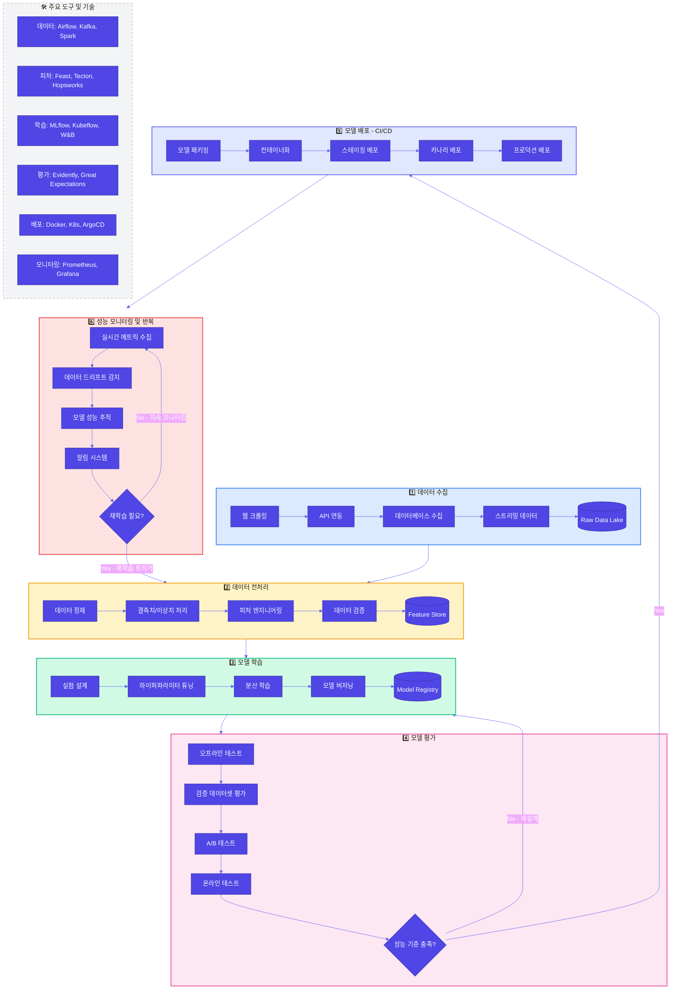

# MLops 정리하기.

이전에 스터디하면서 발표자분이 정말 내용을 꽉꽉 채워 이야기해주셔서 배웠던 게 많았던 발표인데 내용을 정리하지 않으면 영영 까먹을 것 같아 정리해본다.

## 💡 MLOps란 무엇인가?

**MLOps**: 머신러닝 운영(Machine Learning Operations)의 약자로, AI 시스템의 개발, 테스트, 배포, 모니터링 등의 과정을 효율적으로 관리하고 최적화하는 기술을 의미한다.  
**그럼 왜 이런 기술이 필요할까?**  
AI 모델은 시간이 지남에 따라 새로운 패턴의 등장 혹은 데이터 분포의 변화 등으로 성능이 저하되거나 모델의 편향성이 발생할 수 있다. 또한, 여러 버전의 모델이 동시에 개발되면 실험 결과의 일관성이 부족해서 재현성이 낮아지는 문제가 발생한다.  
때문에 AI 성능의 유지를 위해서는 지속적인 모니터링/ 업데이트가 필요하다. 이때 이를 자동화하고 효율적으로 관리하는 것이 MLOps이다.

### ✅ MLOps의 주요 구성 요소

| 구성 요소 | 정의 | 비고 |
| :--- | :--- | :--- |
| **버전 관리**   (Version Control) | 데이터, 코드, 모델 바이너리 및 설정의 변경 사항을 체계적으로 추적하고 기록하는 프로세스 | • 코드: 모델 학습 및 실험을 위한 코드, 서비스 배포를 위한 코드 등   • 데이터: 모델 학습 시 사용한 데이터셋, 평가 시에 사용한 데이터셋 등    • 모델: 각 실험마다 생성된 모델 등    • 개발환경: 각 실험을 수행하기 위한 개발환경, 서비스 배포를 위한 개발환경 등 |
| **CI/CD**   (Continuous Integration/Continuous Deployment) | 소프트웨어 및 머신러닝 모델의 개발 생애주기를 자동화하고 간소화하기 위한 일련의 관행과 도구 | • CI (Continuous Integration): 모델을 지속적으로 통합하고 테스트하는 것  • CD (Continuous Deployment): 자동 배포를 통해 운영 환경에 모델 서비스를 안정적으로 배포하는 것|
| **모니터링**   (Monitoring) | 실제 운영 환경에서 어떻게 성능을 발휘하는지 체계적으로 추적하고 측정하며 이해하는 일련의 과정 |• 모델 성능 및 데이터 품질 모니터링 필요   • 모델 드리프트 감지, 실시간 경고 시스템 구축|

## 💡 MLOps 파이프라인은 무엇인가?
**파이프라인**: 데이터 수집, 전처리, 모델 학습, 평가, 배포, 모니터링을 포함한 MLOps 전체의 흐름을 이어주는 개념

### 🛠️ 파이프라인의 단계

파이프라인은 크게 6가지 단계로 구성된다.

1. **데이터 수집** : 다양한 소스로부터 데이터를 수집하고 통합하는 것
2. **데이터 전처리** : 정규화, 결측치 처리, 피처 엔지니어링 등을 통해 모델 학습에 부정적 영향을 끼치는 데이터를 제거하는 것
3. **모델 학습** : 데이터를 기반으로 모델을 학습하는 것.
4. **모델 평가** : 모델의 성능을 평가하는 것. 모델을 평가할 때는 도메인, 모델 알고리즘 등의 종류에 따라서 다양한 평가 지표를 선택할 수 있음. 일반적인 오프라인 지표 테스트 뿐만 아닌, A/B테스트와 같은 온라인 테스트도 수행 가능
5. **모델 배포** : CI/CD를 통해 모델을 배포한다. 이때, 서비스의 목적과 특성 그리고 달성하고자 하는 비즈니스 목표 등에 따라서 배포 전략이 달라질 수 있다. 대표적으로는 실시간 배포와 배치성 배포를 살펴볼 수 있다.
6. **성능 모니터링 및 반복** : 모델의 성능을 모니터링하고 반복하는 것. CICD 파이프라인을 통해 자동 배포 후 모니터링을 통한 성능 확인을 진행한다.

이를시각적으로 나타내보면 아래와 같다.

### 📌 MLOps의 tool
- **Docker**: 모델 및 의존성 환경을 컨테이너화하여 재현성과 이식성을 제공
- **Kubernetes**: 컨테이너 오케스트레이션 서비스로, 컨테이너화된 애플리케이션의 배포, 확장, 관리를 자동화하는 도구. 안정적인 서비스 운용을 위한 확장성과 자동배포 관리를 지원한다
- **Prometheus**: 이벤트 모니터링 및 경고에 사용되는 오픈소스 모니터링 툴 (데이터 수집 역할)
- **Grafana**: 시계열 메트릭 데이터를 시각화하는데 최적화된 오픈소스 툴 (수집한 데이터툴 시각화)
- **MLFlow**: 머신러닝 모델의 실험을 트래킹하고, 모델을 공유 및 배포하는데 활용할 수 있는 오픈소스 툴. 각 experiment, run마다 메트릭의 성능, 학습에 사용한 코드, 의존성, 데이터, 학습 모델을 백업하고, 해당 내역을 계층적으로 조회해볼 수 있어 버전 관리에 용이함
- **KubeFlow**: Kubernetes(k8s)를 기반으로 머신러닝 파이프라인을 자동화하는 플랫폼
- **Jenkins**:CI/CD를 통해 모델 훈련 및 배포 자동화
- **ArgoCD**: GitOps 방식으로 Kubernetes 배포 관리 (깃에 커밋된 내용을 토대로 자동 배포)
- **DVC**: 데이터와 모델의 버전 관리를 지원
- **Kafka**: 실시간 데이터 처리를 위한 메시지 큐
- **Airflow**: 데이터 워크플로우를 관리하는 오픈소스 툴
- **Spark**: 분산 컴퓨팅을 위한 오픈소스 툴

## 💡 모니터링과 버전 관리

**모델 모니터링의 중요성:** 데이터 및 모델 성능에 대한 지속적인 모니터링을 통해 모델의 성능이 떨어지는지 아닌지 확인할 필요성이 있다.  
특히 데이터에 시간이 특성이 반영되는 경우라면, 보편적으로 데이터가 달라질 때 모델의 성능이 떨어지는 현상이 있는데 이를 모델 드리프트라고 한다.  
이러한 문제점은 재학습 등을 통해 해결할 수 있으나 시간이 지날수록 리소스가 많이 필요해지기 때문에 모니터링을 통해 이를 확인하고 이를 통해 모델을 재학습하는 것이 효율적이다.

**버전 관리의 중요성:** 학습에 사용하는 데이터의 버전, 데이터에서 추출한 피처의 버전, 모델 구조의 버전 등 학습 시 결과에 영향을 끼칠 수 있는 다양한 요인이 존재한다. 때문에 이를 잘 기록하여 버전관리를 해야 실수로 재현성을 해치거나 성능을 해치는 경우를 방지할 수 있다.(이때 MLflow나 DVC와 같은 버전 관리 툴을 사용하면 쉽게 관리할 수 있다.)