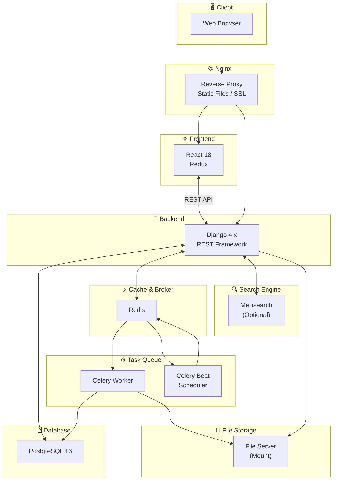

# 회사에서 진행했던 일들 정리: 데이터 관리 웹 구축

기존 블로그에 회사 프로젝트에 Celery를 적용한 내용을 정리하면서 "그래서 뭐 만들었는지"도 소개하는게 좋을 것 같아 작성했다.
자세한 코드 및 api 명세서 등등은 제외하고, 아키텍쳐 정도는 공개해도 될 것 같아서  
프로젝트 개요/주요 업무/기능/성과 정도만 써 볼 생각이다
원래 Tech 쪽에 올리는 게 맞지 않나 했는데 프로젝트 카테고리가 맞을 것 같아서 이쪽으로 올린다.

## 📝 프로젝트 개요

온프레미스 파일 서버의 파일 및 디렉토리를 데이터베이스화하여 검색, 관리, 동기화를 원활하게 수행하기 위한 웹 기반 파일 관리 시스템 구축.

## 🔨 아키텍쳐 & 기술

**기술스택**

| 구분 | 기술 |
|------|------|
| Backend | Django 4.x + Django REST Framework |
| Frontend | React 18, Redux |
| Database | PostgreSQL 16 |
| Cache/Broker | Redis |
| Task Queue | Celery + Celery Beat |
| Search Engine | Meilisearch (선택적 사용 가능) |
| Container | Docker / Docker Compose |
| Web Server | Nginx |
| Authentication | JWT + Session |

**아키텍쳐**

## 📍 주요 업무

### 1. Backend API 설계 및 개발
- Django REST Framework 기반 RESTful API 구현
- JWT 인증 및 권한 관리 시스템 구축 (최고관리자/관리자/일반유저 3단계 권한)
- Swagger/OpenAPI 문서 자동화 (drf-yasg)

### 2. 비동기 작업 처리 시스템 구축
- Celery 기반 12개 작업 큐 설계 (업로드, 다운로드, 삭제, 복사, 이동, 압축, 스캐너, 썸네일 등)
- Celery Beat 스케줄러를 통한 주기적 작업 자동화
- 분산 락(Resource Lock) 시스템 구현으로 동시 작업 충돌 방지

### 3. 파일 시스템 스캐너 개발
- 증분/전체 스캔 기능 구현
- DB-파일 시스템 간 동기화 로직 개발
- 마운트 상태 모니터링 및 파일 존재 검증

### 4. 검색 시스템 구현
- Meilisearch 연동 전문 검색
- PostgreSQL Fallback 검색 구현

### 5. 관리자 대시보드 개발
- Django Admin 커스터마이징
- 시스템 모니터링 대시보드 (CPU, 메모리, 디스크, 프로세스)
- 스캐너 모니터링 및 수동 실행 기능

### 6. 인프라 구성 및 Docker화
- 개발/테스트/운영 환경 Docker Compose 구성
- Nginx 리버스 프록시 및 SSL 설정

### 7. Frontend 개발
- React 18 기반 SPA 구현
- Redux를 활용한 전역 상태 관리
- 파일/폴더 관리 UI 개발
- 검색 및 조회 UI 개발

## 📊 기능
### 파일/폴더 관리
- **업로드**: 청크 업로드 지원 (대용량 파일 분할 전송, 무결성 검증), 폴더 구조 유지 업로드
- **다운로드**: 단일/다중 파일·폴더 ZIP 압축 다운로드
- **파일/폴더 작업**: 이동, 복사, 이름 변경 (일괄처리 가능), 압축
- **휴지통**: 임시 삭제 → 복구 가능 → 영구 삭제 3단계 관리

### 검색 및 조회
- **통합 검색**: 파일명, 설명, 확장자 기반 검색
- **필터링**: 파일 타입, 크기 범위, 날짜, 특정 폴더
- **정렬**: 이름, 크기, 업로드일, 수정일, 파일 타입

### 이미지 처리
- **썸네일 생성**: Small(150px) / Medium(300px) / Large(800px)
- **Redis 캐싱**: 썸네일 이미지 캐시 저장
- **EXIF 정보 추출**: 카메라 정보, 이미지 크기 정보 자동으로 DB에 저장

### 자동화 (Celery Beat)
- 증분 스캔: 매시간
- 전체 스캔: 주 1회 (일요일 06:00)
- 마운트 상태 확인: 30분마다
- 검색 인덱스 업데이트: 매시간
- 만료 세션/청크/캐시 정리: 자동

### 관리자 기능
- Django Admin 커스터마이징
- 유저별 권한 관리
- 시스템 대시보드 (CPU, 메모리, 디스크)
- 스캐너 모니터링
- 파일 중복 제거 (해시 기반)

### 부가 기능
- **스마트폰 대여 관리**: 기기 등록, 대여/반납 처리, 사용 리포트 CSV 내보내기

## ✅ 성과
- 사내 테스트 서버 배포
- 팀 내 테스트 환경 구축 및 테스트 진행

## 📂 자료 정리(추가 중)
- [Django에 Celery 사용하기(1)](https://world970511.github.io/blog/posts/2025-10-02-2-1.html)
- [Django에 Celery 사용하기(2)](https://world970511.github.io/blog/posts/2025-11-09-2-2.html)
- [Django에 Celery 사용하기(3)](https://world970511.github.io/blog/posts/2025-12-29_데이터_관리_웹.md)
