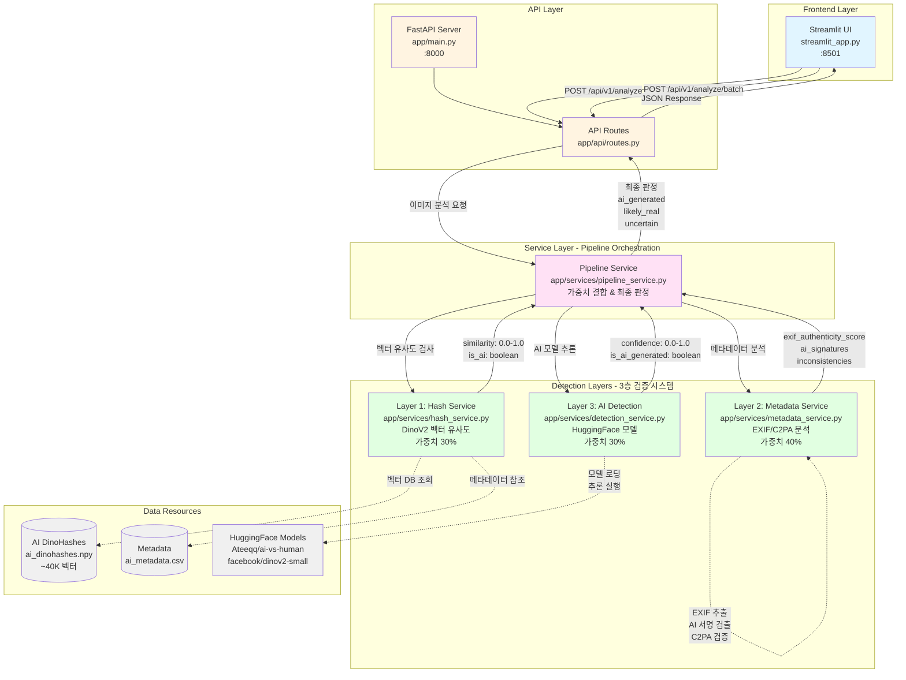

# 3-Layer Image Filter

예전에 회사에서 이미지 수집을 처리하면서 고민이 된 부분이 ai로 생성된 이미지를 어떻게 탐지할 수 있는가?였다.  
이게 학습 데이터를 모으다 보니 데이터 품질에 대해 고민할 일이 많았다보니 생각하게 된 거였는데, 지금이야 그냥 찾으면 대부분이 진짜 이미지인 것이 많지만 나중에는 이런 부분으로 문제가 생길 것 같았다.  
당시에 실제로 그런 상황이 있었던 적도 있고..(수집했더니 생성 이미지여서 지운다든가 등의..)  
그래서 구글에서 홍보하는 SynthID를 보고 굉장히 흥미롭다고 생각했는데, 생각해보니 ai 생성 이미지들의 특징(메타데이터 부족 등등) + 오픈소스 ai 탐지 모델을 가지고 탐지 파이프라인을 구축할 수 있지 않을까....? 라는 생각이 들어서 일단 만들어 보았다  

## ❓ 프로젝트 구조는 ? 
[깃허브](https://github.com/world970511/ai-image-filter) readme에도 작성하긴 했지만  
내 기본적인 아이디어는 ai로 생성된 이미지의 경우 일반 디지털 사진에 있는 카메라 모델, 렌즈 유형, 셔터 속도, GPS 위치 정보 등 EXIF 데이터가 존재하지 않는다는 부분에 집중한다.  
처음에는 그냥 그거만 체크하면 해결 될 것 같은데? 하고 있다가 생각해보니 학습 데이터와 같은 것들은 exif와 메타데이터 다 지우는 경우도 있고, 이미지를 변형하거나 수정할 경우 없어질 수도 있는데 그걸로만 판단을 하는 것은 아닌 것 같았다.  

그래서 두 번째로 고민한 것은 해시였다. 해시를 사용해서 db에 이미지의 해시값을 저장해서 변형된 이미지의 탐지를 하면... 되지 않을까? 라고 생각했다.  
그런데 db를 만들고 싶지는 않았고, db로 비교하는 경우 db에 있는 파일들만 분석 가능한거 아닌가? 라는 생각이 들어 조사를 해 보던 중 Provenance Detection for AI-Generated Images라는 논문을 보고 dinoV2를 해시처럼 사용해서 탐지하고, 해시 - 메타데이터 - 오픈소스 탐지 모델 이렇게 3Layer로 탐지 파이프라인을 짜면 정확도를 올릴 수 있지 않을까 싶었다.  

그래서 이를 머메이드로 나타내면 밑과 같다.

Architecture Overview

    Frontend Layer
    - Streamlit UI (Port 8501): 사용자 인터페이스, 단일/배치 이미지 분석 지원

    API Layer
    - FastAPI Server (Port 8000): RESTful API 서버
    - API Routes: /api/v1/analyze (단일), /api/v1/analyze/-batch (배치) 엔드포인트

    Service Layer
    - Pipeline Service: 3개 레이어를 통합하여 최종 판정 수행
    Detection Layers (3층 검증 시스템)
    - Layer 1 :Hash Service (30%), DinoV2 기반 벡터 유사도 검사
    - Layer 2 :Metadata Service (40%), EXIF/C2PA 메타데이터 분석
    - Layer 3 :AI Detection (30%), HuggingFace 모델 기반 AI 생성 탐지

    Data Resources
    - AI DinoHashes: ~40,000개 AI 이미지 벡터 

    데이터베이스
    - Metadata CSV: 이미지 메타데이터 참조
    - ML Models: HuggingFace 사전학습 모델

    Final Verdict Logic
    - AI 비율 ≥ 70%: ai_generated
    - AI 비율 ≤ 30%: likely_real
    - 30% < AI 비율 < 70%: uncertain

## 💡 AI Image Filter TEST
일단 테스트를 위해 밑과 같은 데이터셋을 만들었다.
 

- **dinoHash**: DinoV2 기반 벡터 유사도를 살펴보기 위한 이미지 데이터셋. AI DinoHashes(백터 데이터소스) 구현 시 사용된 데이터셋 [ai-vs-human-generated-dataset](https://www.kaggle.com/datasets/alessandrasala79/ai-vs-human-generated-dataset/data)중 랜덤으로 데이터를 20개 골라서 이미지에 필터 추가/ 사이즈 변형/ 채도&명도 등 변경 등의 작업을 한 데이터이다.  훼손 혹은 변경되었어도 DinoV2 통한 추적이 가능한지 확인하기 위해서 만들었다.
 

- **human**: 한국인 남녀 증명사진 데이터셋이다. 10~60 대 남녀의 정면 사진을 ChatGPT와 Gemini를 사용하여 생성 후 편집을 진행했다(하단 워터마크 제거, 채도/명도 조정, 사이즈 변형, 필터 추가 등)
ai로 생성된 인물 사진에 추가 편집을 거친 이미지를 탐지하는 것이 가능한지 확인하기 위해서 만들었다.  
 

데이터셋은 dinohash를 빼고 파이썬을 사용해서 동일한 규격(600*800)으로 변형했고, 파일 형식도 jpg로 통일하였다.  
 

테스트 결과는 아래와 같다.  
 

**dinoHash**
> 테스트 20개 이미지 중
> 🤖 AI 생성: 13 | ✅ 실제 이미지: 3 | ❓ 불확실: 4
>  DinoV2를 사용할 경우, 변경된 이미지들도 추적 가능하지만 test_6.jpg 처럼 AI 모델에서도, DinoV2에서도 판단이 어려운 이미지가 있음을 볼 수 있다.

| 파일명 | 판정 | 확신도 | DinoV2 유사도 | EXIF 진위성 | AI 시그니처 | EXIF 비정상 |
| :--- | :--- | :--- | :--- | :--- | :--- | :--- |
| test_1.jpg | uncertain | 67.3% | 78.0% | 0.00 | - | 0 |
| test_2.jpg | ai_generated | 100.0% | 88.4% | 0.00 | - | 0 |
| test_3.jpg | ai_generated | 75.0% | 71.3% | 0.00 | - | 0 |
| test_4.jpg | likely_real | 81.8% | 65.2% | 0.00 | - | 0 |
| test_5.jpg | ai_generated | 72.7% | 65.9% | 0.00 | - | 0 |
| test_6.jpg | likely_real | 80.9% | 38.2% | 0.00 | - | 0 |
| test_7.jpg | ai_generated | 72.7% | 68.7% | 0.00 | - | 0 |
| test_8.jpg | ai_generated | 74.9% | 71.2% | 0.00 | - | 0 |
| test_9.jpg | ai_generated | 99.1% | 84.5% | 0.00 | - | 0 |
| test_10.jpg | uncertain | 51.7% | 88.5% | 0.00 | - | 0 |
| test_11.jpg | ai_generated | 72.7% | 54.1% | 0.00 | - | 0 |
| test_12.jpg | ai_generated | 87.3% | 78.0% | 0.00 | - | 0 |
| test_13.jpg | ai_generated | 96.6% | 83.1% | 0.00 | - | 0 |
| test_14.jpg | uncertain | 66.1% | 78.6% | 0.00 | - | 0 |
| test_15.jpg | uncertain | 57.0% | 83.6% | 0.00 | - | 0 |
| test_16.jpg | ai_generated | 72.7% | 61.8% | 0.00 | - | 0 |
| test_17.jpg | likely_real | 81.8% | 59.0% | 0.00 | - | 0 |
| test_18.jpg | ai_generated | 91.9% | 80.6% | 0.00 | - | 0 |
| test_19.jpg | ai_generated | 90.7% | 79.9% | 0.00 | - | 0 |
| test_20.jpg | ai_generated | 72.7% | 55.0% | 0.00 | - | 0 |

 

**human**
> 테스트 24개 이미지 중
> 🤖 AI 생성: 21 | ✅ 실제 이미지: 3 | ❓ 불확실: 0
> AI로 생성된 인물 사진에 추가 편집을 거친 경우에도 대부분 AI 생성물로 탐지되는 것을 확인할 수 있다. 특이점은 백터 데이터소스 생성 시 사용되지 않은 데이터셋임에도 유사도가 높음을 볼 수 있다.(DinoV2로 임베딩한 것 끼리 유사성을 파악할 수 있다.)

| 파일명 | 판정 | 확신도 | DinoV2 유사도 | EXIF 진위성 | AI 시그니처 | EXIF 비정상 |
| :--- | :--- | :--- | :--- | :--- | :--- | :--- |
| ChatGPT_10_man.jpg | ai_generated | 72.7% | 68.0% | 0.00 | - | 0 |
| ChatGPT_10_woman.jpg | ai_generated | 81.1% | 74.6% | 0.00 | - | 0 |
| ChatGPT_20_man.jpg | ai_generated | 72.7% | 66.5% | 0.00 | - | 0 |
| ChatGPT_20_woman.jpg | ai_generated | 81.8% | 75.0% | 0.00 | - | 0 |
| ChatGPT_30_man.jpg | ai_generated | 72.7% | 69.7% | 0.00 | - | 0 |
| ChatGPT_30_woman.jpg | ai_generated | 79.2% | 73.6% | 0.00 | - | 0 |
| ChatGPT_40_man.jpg | likely_real | 77.1% | 72.3% | 0.00 | - | 0 |
| ChatGPT_40_woman.jpg | ai_generated | 72.7% | 68.1% | 0.00 | - | 0 |
| ChatGPT_50_man.jpg | ai_generated | 73.2% | 70.3% | 0.00 | - | 0 |
| ChatGPT_50_woman.jpg | ai_generated | 72.6% | 67.9% | 0.00 | - | 0 |
| ChatGPT_60_man.jpg | ai_generated | 72.7% | 67.0% | 0.00 | - | 0 |
| ChatGPT_60_woman.jpg | ai_generated | 80.3% | 74.1% | 0.00 | - | 0 |
| Gemini_10_man.jpg | ai_generated | 72.7% | 69.8% | 0.00 | - | 0 |
| Gemini_10_woman.jpg | ai_generated | 83.5% | 75.9% | 0.00 | - | 0 |
| Gemini_20_man.jpg | ai_generated | 77.6% | 72.7% | 0.00 | - | 0 |
| Gemini_20_woman.jpg | ai_generated | 85.4% | 77.0% | 0.00 | - | 0 |
| Gemini_30_man.jpg | ai_generated | 78.1% | 72.9% | 0.00 | - | 0 |
| Gemini_30_woman.jpg | ai_generated | 74.2% | 70.8% | 0.00 | - | 0 |
| Gemini_40_man.jpg | likely_real | 75.9% | 72.9% | 0.00 | - | 0 |
| Gemini_40_woman.jpg | ai_generated | 74.2% | 70.8% | 0.00 | - | 0 |
| Gemini_50_man.jpg | ai_generated | 78.0% | 72.9% | 0.00 | - | 0 |
| Gemini_50_woman.jpg | ai_generated | 72.4% | 68.7% | 0.00 | - | 0 |
| Gemini_60_man.jpg | ai_generated | 84.6% | 76.6% | 0.00 | - | 0 |
| Gemini_60_woman.jpg | likely_real | 81.8% | 62.9% | 0.00 | - | 0 |

 

## 💡 Gemini vs 3-Layer AI Image Filter

그렇다면  3-Layer AI Image Filter와 SynthID를 비교해보면 어떤 결과가 나올까?  
 
일단 테스트를 위한 이미지들을 준비해보았다.  
 

**view**: 실제 이미지/ 실제 이미지를 바탕으로 동일한 프롬프트를 작성한 후 ChatGPT와 Gemini에 제공하여 이미지를 생성/보정한 후 편집한 이미지 데이터셋이다. 그러니까 실제,챗지피티 이미지, 제미니 이미지 이렇게 3가지 형식으로 구현되어 있다.  2가지를 확인하기 위해 구현했는데 하나는 ai가 변형이 아니라 보정 등으로만 사용되었을 경우에도 생성형으로 판정되는지 궁금해서 이를 확인하기 위해서였고, 다른 하나는 프롬프트를 바탕으로 만들어진 이미지와 실제 이미지가 얼마나 비슷한지 확인하기 위해서였다.  
 
파이썬을 사용해서 동일한 규격(600*800)으로 변형했고, 파일 형식도 jpg로 통일하였다.  
또한 실제 이미지도 어느 정도의 변형(색채/선명도 등 변경)을 하여 판별이 어렵도록 만들어보았다.  
 
SynthID API를 사용하여 일괄적으로 테스트를 처리하고 싶었지만, 현재 SynthID API는 텍스트만 지원하고 있기 때문에 [Gemini 고객센터](https://support.google.com/gemini/answer/16722517?hl=ko&co=GENIE.Platform%3DDesktop)를 참고해서 하나하나 직접 입력하는 식으로 테스트를 진행했다.
 
테스트 결과는 아래와 같다.
 

**view**
| 파일명 | GEMINI | 3-layers | 일치 여부 | 3-layers(ai-detection) | 3-layers(DinoV2) | Gemini 판정 이유 |
| :--- | :--- | :--- | :--- | :--- | :--- | :--- |
| real_spring_Sinchon.jpg | 실사 촬영 | 실사 촬영 | 일치 | 81.8% | 49.0% | 도로명 주소와 브랜드 로고가 실제와 일치하며 건물 투시가 현실적임. |
| ChatGPT_spring_Sinchon.jpg | ai 편집/변형 유력 | 실사 촬영 | 불일치 | 81.8% | 51.3% | 존재하지 않는 단어(임적증)와 물리적으로 불가능한 파이프 구조물 생성. |
| Gemini_spring_Sinchon.jpg | ai 편집/변형 유력 | 실사 촬영 | 불일치 | 81.8% | 48.8% | 간판 글자 조합이 비논리적이며 인물의 이목구비가 뭉개진 형태임. |
| real_summer_France.jpg | 실사 촬영 | 실사 촬영 | 일치 | 81.8% | 45.5% | 식물의 무작위적 성장 패턴과 표지판 마모가 실제 물리적 환경과 일치함. |
| ChatGPT_summer_France.jpg | ai 편집/변형 유력 | 실사 촬영 | 불일치 | 81.8% | 69.6% | 원거리 돌바닥의 패턴화 오류와 자전거 바퀴살의 물리적 연결 부정확. |
| Gemini_summer_France.jpg | ai 편집/변형 유력 | 실사 촬영 | 불일치 | 81.8% | 63.5% | 인위적인 조명 효과와 꽃/자전거 질감의 디지털 뭉개짐이 관찰됨. |
| real_autumn_fruit.jpg | 실사 촬영 | 실사 촬영 | 일치 | 81.8% | 36.3% | 나뭇가지의 무작위적 분기 구조와 자연스러운 디지털 노이즈가 관찰됨. |
| ChatGPT_autumn_fruit.jpg | ai 편집/변형 유력 | 실사 촬영 | 불일치 | 81.8% | 43.9% | 배경-피사체 경계가 인위적으로 깔끔하며 조명 방향이 불일치함. |
| Gemini_autumn_fruit.jpg | ai 편집/변형 유력 | ai 편집/변형 유력 | 일치 | 72.5% | 48.2% | 나뭇가지 끝처리가 단절되어 있으며 전체적으로 단순화된 디지털 구조임. |
| real_winter_Christmas.jpg | 실사 촬영 | 실사 촬영 | 일치 | 81.8% | 49.0% | 저조도 촬영 센서 노이즈와 광원의 자연스러운 빛 번짐이 확인됨. |
| ChatGPT_winter_Christmas.jpg | ai 편집/변형 유력 | ai 편집/변형 유력 | 일치 | 72.7% | 41.3% | 보케 패턴이 지나치게 균일하며 피사체와 배경 간의 레이어감이 부자연스러움. |
| Gemini_winter_Christmas.jpg | ai 편집/변형 유력 | 실사 촬영 | 불일치 | 81.8% | 42.0% | 강아지 털의 덩어리 표현과 스피커의 매끄러운 렌더링 질감이 관찰됨. |
| real_not_edit_1.jpg | 실사 촬영 | 실사 촬영 | 일치 | 81.8% | 47.0% | 배경 건물 로고, 차량, 텍스트가 명확하며 물리적/지리적 맥락이 일치함. |
| ChatGPT_edit_1.jpg | ai 편집/변형 유력 | 실사 촬영 | 불일치 | 81.8% | 44.7% | 깃발의 한국어 텍스트가 실제 언어가 아닌 비정형 기호로 붕괴되어 있음. |
| Gemini_edit_1.jpg | ai 편집/변형 유력 | 실사 촬영 | 불일치 | 81.8% | 46.5% | 깃발 주변부에 미세한 아티팩트와 배경 결합 불일치가 발견됨. |
| real_not_edit_2.jpg | 실사 촬영 | ai 편집/변형 유력 | 불일치 | 72.7% | 50.4% | 조각상의 마모 상태와 그림자 경계가 자연스러운 광학적 특성을 유지함. |
| ChatGPT_edit_2.jpg | ai 편집/변형 유력 | ai 편집/변형 유력 | 일치 | 72.7% | 53.5% | 야간 촬영 특유의 노이즈 대신 인위적인 디지털 입자감이 관찰됨. |
| Gemini_edit_2.jpg | ai 편집/변형 유력 | ai 편집/변형 유력 | 일치 | 72.7% | 54.6% | 대비와 선명도가 부자연스럽고 조각상 질감이 디지털 렌더링 특유의 광택을 띰. |
 

## 🔚결론
AI모델 성능에 따라 판정이 달라질 수 있는 점이 아쉽기는 해도, 상용 모델을 사용하여 판정하지 않아도 여러 레이어를 통해 어느 정도의 필터링이 가능하다는 장점이 있다.  
SynthID 가 다른 생성형 AI에서도 보편적으로 사용되거나, 생성형 AI로 생성된 이미지를 구분할 수 있도록 워터마크 혹은 메타데이터 입력이 강제화되거나 한다면 더 좋겠지만 현재 상황에서 이미지 데이터 오염을 막기에는 나쁘지 않은 방법이라고 생각한다.  
또한 DinoV2를 지각적 해싱으로 사용할 때 미리 임베딩된 데이터셋이 아니더라도 어느 정도의 유사도를 비교할 수 있다는 것은 추후 다른 방도로도 활용될 수 있지 않을까? 라는 생각을 하게 되었다.  
